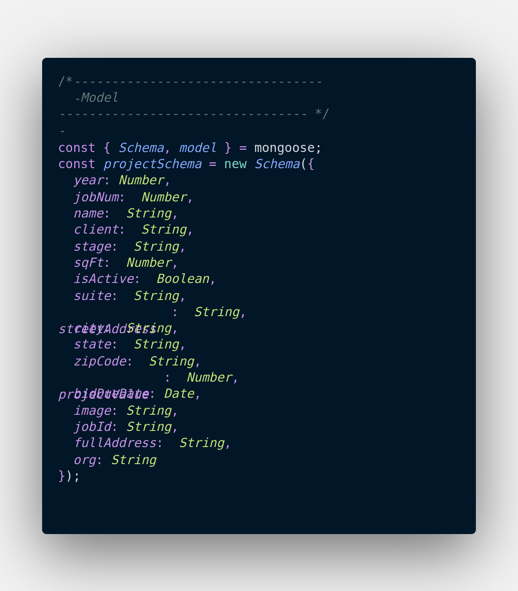

# BuildHub
A construction project tracking web app by Craig McGowan

Link to deployment:
https://craigmcgowan-project2.herokuapp.com/

Link to GitHub Repo:
https://github.com/craig-mcgowan/ringo-project2

## Project Description
#### Project Description
Buildhub is an online project tracking database that allows users to manage and share projects among their organization. Users can log in and create projects, edit existing projects, and remove or archive inactive projects.

The below schema shows what information can be stored with in the app:

#### Instructions for Use
After signing in, users are directed to the project log which shows important details about all the user's projects at a glance. From there, they can add a new project or log out from the navbar menu. They can also click on a project name to enter the show page to view additional project details or photos. From the show page users can also edit or delete projects.
#### Wireframes and Planning Boards

#### Technologies Used
Javascript, HTML, CSS, ExpressJS, EJS, HTMX, NodeJS, SASS, Morgan, BCrypt, Trello
#### Code Snippets

#### Known bugs
On loading the show and edit pages, the browser will log a flow error in the console. The page must be refreshed for JavaScript to function

#### Future Features
##### General
- Mobile Degin
- Project Sorting and Filtering
- Styling based on project stage/status
- Weather at site

##### Estimating 
- Insert and update square footage costs, unit, hourly/daily rates for trades 
- Calculate line items

##### Forms
- Fill out building access request forms and download as PDF

